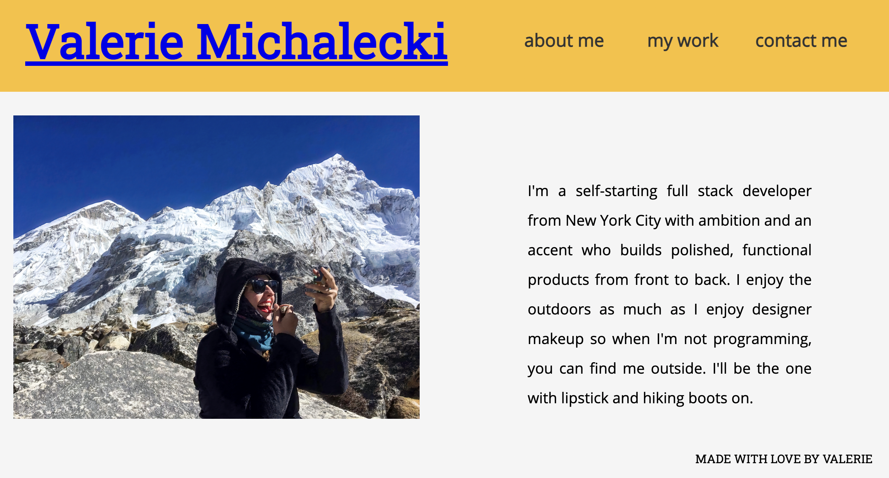

# React-Portfolio

## Description

I've converted my portfolio to fully functional single-page React application.

## Table of Contents

- [Deployed Application](#Deployed-Application)
- [License](#license)
- [Future Development](#Future-Development)
- [Questions](#questions)

## Deployed Application

Click [here](https://vmichalecki.github.io/react-portfolio/) to view the deployed portfolio.

## License

[MIT](https://choosealicense.com/licenses/mit/)

## Future Development

As I increase my skill set and launch more products, I will continue to add projects to this portfolio and further develop the design.

## Questions

For additional information please contact me via GitHub at [https://github.com/vmichalecki](https://github.com/vmichalecki) or via email at [valerie227@gmail.com](mailto:valerie227@gmail.com?subject=[GitHub]%React%Portfolio).

